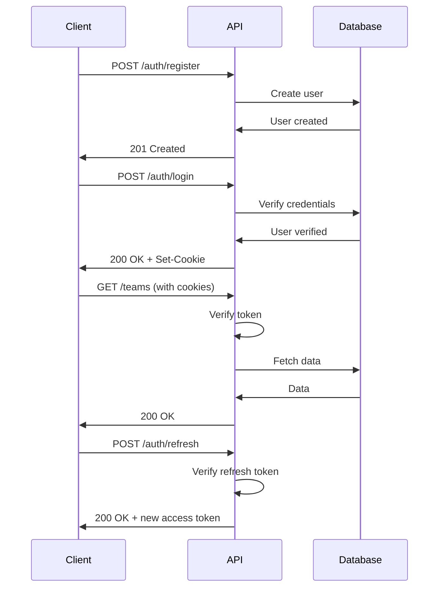

# Authentication API

Complete authentication API reference for user registration, login, logout, session management, and account operations.

## Table of Contents

- [Overview](#overview)
- [Authentication Flow](#authentication-flow)
- [Endpoints](#endpoints)
  - [Register User](#register-user)
  - [Login](#login)
  - [Logout](#logout)
  - [Logout All Sessions](#logout-all-sessions)
  - [Refresh Token](#refresh-token)
  - [Update Activity](#update-activity)
  - [Get Current User](#get-current-user)
  - [Update Profile](#update-profile)
  - [Change Password](#change-password)
  - [Get Active Sessions](#get-active-sessions)
  - [Revoke Session](#revoke-session)
  - [Account Deletion](#account-deletion)
- [Error Codes](#error-codes)

## Overview

The Authentication API provides secure user authentication using JWT tokens with HTTP-only cookies. Key features include:

- **Secure Token Storage**: HTTP-only cookies prevent XSS attacks
- **Token Refresh**: Automatic token refresh for seamless user experience
- **Session Management**: Track and manage active sessions
- **Rate Limiting**: Protection against brute force attacks
- **Account Security**: Password hashing with bcrypt

## Authentication Flow



## Endpoints

### Register User

Create a new user account.

**Endpoint**

```
POST /api/v1/auth/register
```

**Authentication**

- None required

**Rate Limit**

- 5 requests per 15 minutes

**Request Body**

```json
{
  "email": "string (required, valid email)",
  "password": "string (required, min 8 chars, must include uppercase, lowercase, number, special char)",
  "firstName": "string (required, 1-50 chars)",
  "lastName": "string (required, 1-50 chars)",
  "marketingOptIn": "boolean (optional, default: false)"
}
```

**Validation Rules**

- `email`: Valid email format, unique in database
- `password`: Minimum 8 characters, must contain:
  - At least 1 uppercase letter
  - At least 1 lowercase letter
  - At least 1 number
  - At least 1 special character (!@#$%^&\*)
- `firstName`: 1-50 characters
- `lastName`: 1-50 characters

**Success Response**

```http
HTTP/1.1 201 Created
Content-Type: application/json

{
  "success": true,
  "data": {
    "user": {
      "id": "550e8400-e29b-41d4-a716-446655440000",
      "email": "user@example.com",
      "firstName": "John",
      "lastName": "Doe",
      "avatarUrl": "https://api.dicebear.com/7.x/avataaars/svg?seed=John",
      "createdAt": "2026-04-29T12:00:00.000Z"
    }
  }
}
```

**Error Responses**

**400 Bad Request - Validation Error**

```json
{
  "success": false,
  "error": {
    "code": "VALIDATION_ERROR",
    "message": "Validation failed",
    "details": [
      {
        "field": "email",
        "message": "Invalid email format"
      },
      {
        "field": "password",
        "message": "Password must contain at least one uppercase letter"
      }
    ]
  }
}
```

**409 Conflict - Email Already Exists**

```json
{
  "success": false,
  "error": {
    "code": "CONFLICT",
    "message": "Email already registered"
  }
}
```

**Example Request**

```bash
curl -X POST https://api.scrsphere.dev/api/v1/auth/register \
  -H "Content-Type: application/json" \
  -d '{
    "email": "john.doe@example.com",
    "password": "SecurePass123!",
    "firstName": "John",
    "lastName": "Doe"
  }'
```

---

### Login

Authenticate a user and receive access tokens.

**Endpoint**

```
POST /api/v1/auth/login
```

**Authentication**

- None required

**Rate Limit**

- 10 requests per 15 minutes

**Request Body**

```json
{
  "email": "string (required)",
  "password": "string (required)"
}
```

**Success Response**

```http
HTTP/1.1 200 OK
Set-Cookie: accessToken=eyJhbGc...; Path=/; HttpOnly; Secure; SameSite=Strict; Max-Age=900
Set-Cookie: refreshToken=eyJhbGc...; Path=/; HttpOnly; Secure; SameSite=Strict; Max-Age=604800
Content-Type: application/json

{
  "success": true,
  "data": {
    "user": {
      "id": "550e8400-e29b-41d4-a716-446655440000",
      "email": "user@example.com",
      "firstName": "John",
      "lastName": "Doe",
      "avatarUrl": "https://api.dicebear.com/7.x/avataaars/svg?seed=John"
    },
    "session": {
      "id": "550e8400-e29b-41d4-a716-446655440001",
      "createdAt": "2026-04-29T12:00:00.000Z",
      "expiresAt": "2026-04-29T12:15:00.000Z"
    }
  }
}
```

**Error Responses**

**401 Unauthorized - Invalid Credentials**

```json
{
  "success": false,
  "error": {
    "code": "AUTHENTICATION_ERROR",
    "message": "Invalid email or password"
  }
}
```

**429 Too Many Requests - Rate Limit Exceeded**

```json
{
  "success": false,
  "error": {
    "code": "RATE_LIMIT_EXCEEDED",
    "message": "Too many login attempts, please try again later."
  }
}
```

**Example Request**

```bash
curl -X POST https://api.scrsphere.dev/api/v1/auth/login \
  -H "Content-Type: application/json" \
  -c cookies.txt \
  -d '{
    "email": "john.doe@example.com",
    "password": "SecurePass123!"
  }'
```

---

### Logout

Logout the current user session.

**Endpoint**

```
POST /api/v1/auth/logout
```

**Authentication**

- Required (cookie or bearer token)

**Request Body**

- None required

**Success Response**

```http
HTTP/1.1 200 OK
Set-Cookie: accessToken=; Path=/; HttpOnly; Secure; Max-Age=0
Set-Cookie: refreshToken=; Path=/; HttpOnly; Secure; Max-Age=0
Content-Type: application/json

{
  "success": true,
  "data": {
    "message": "Logged out successfully"
  }
}
```

**Example Request**

```bash
curl -X POST https://api.scrsphere.dev/api/v1/auth/logout \
  -b cookies.txt
```

---

### Logout All Sessions

Logout from all devices and sessions.

**Endpoint**

```
POST /api/v1/auth/logout-all
```

**Authentication**

- Required (cookie or bearer token)

**Request Body**

- None required

**Success Response**

```http
HTTP/1.1 200 OK
Content-Type: application/json

{
  "success": true,
  "data": {
    "message": "Logged out from all sessions",
    "sessionsRevoked": 3
  }
}
```

**Example Request**

```bash
curl -X POST https://api.scrsphere.dev/api/v1/auth/logout-all \
  -b cookies.txt
```

---

### Refresh Token

Refresh the access token using a valid refresh token.

**Endpoint**

```
POST /api/v1/auth/refresh
```

**Authentication**

- Required (refresh token from cookie)

**Request Body**

- None required (uses cookie)

**Success Response**

```http
HTTP/1.1 200 OK
Set-Cookie: accessToken=eyJhbGc...; Path=/; HttpOnly; Secure; SameSite=Strict; Max-Age=900
Content-Type: application/json

{
  "success": true,
  "data": {
    "message": "Token refreshed successfully"
  }
}
```

**Error Responses**

**401 Unauthorized - Invalid Refresh Token**

```json
{
  "success": false,
  "error": {
    "code": "AUTHENTICATION_ERROR",
    "message": "Invalid or expired refresh token"
  }
}
```

**Example Request**

```bash
curl -X POST https://api.scrsphere.dev/api/v1/auth/refresh \
  -b cookies.txt
```

---

### Update Activity

Update session activity timestamp to prevent idle timeout.

**Endpoint**

```
POST /api/v1/auth/activity
```

**Authentication**

- Required (cookie or bearer token)

**Request Body**

- None required

**Success Response**

```http
HTTP/1.1 200 OK
Content-Type: application/json

{
  "success": true,
  "data": {
    "message": "Activity updated",
    "lastActivity": "2026-04-29T12:30:00.000Z"
  }
}
```

**Example Request**

```bash
curl -X POST https://api.scrsphere.dev/api/v1/auth/activity \
  -b cookies.txt
```

---

### Get Current User

Get the currently authenticated user's profile.

**Endpoint**

```
GET /api/v1/auth/me
```

**Authentication**

- Required (cookie or bearer token)

**Success Response**

```http
HTTP/1.1 200 OK
Content-Type: application/json

{
  "success": true,
  "data": {
    "user": {
      "id": "550e8400-e29b-41d4-a716-446655440000",
      "email": "user@example.com",
      "firstName": "John",
      "lastName": "Doe",
      "avatarUrl": "https://api.dicebear.com/7.x/avataaars/svg?seed=John",
      "createdAt": "2026-04-29T12:00:00.000Z",
      "updatedAt": "2026-04-29T12:00:00.000Z"
    }
  }
}
```

**Example Request**

```bash
curl -X GET https://api.scrsphere.dev/api/v1/auth/me \
  -b cookies.txt
```

---

### Update Profile

Update the current user's profile information.

**Endpoint**

```
PUT /api/v1/auth/me/profile
```

**Authentication**

- Required (cookie or bearer token)

**Request Body**

```json
{
  "firstName": "string (optional, 1-50 chars)",
  "lastName": "string (optional, 1-50 chars)",
  "avatarUrl": "string (optional, valid URL)"
}
```

**Success Response**

```http
HTTP/1.1 200 OK
Content-Type: application/json

{
  "success": true,
  "data": {
    "user": {
      "id": "550e8400-e29b-41d4-a716-446655440000",
      "email": "user@example.com",
      "firstName": "Jane",
      "lastName": "Doe",
      "avatarUrl": "https://api.dicebear.com/7.x/avataaars/svg?seed=Jane",
      "updatedAt": "2026-04-29T13:00:00.000Z"
    }
  }
}
```

**Example Request**

```bash
curl -X PUT https://api.scrsphere.dev/api/v1/auth/me/profile \
  -H "Content-Type: application/json" \
  -b cookies.txt \
  -d '{
    "firstName": "Jane",
    "lastName": "Doe"
  }'
```

---

### Change Password

Change the current user's password.

**Endpoint**

```
PUT /api/v1/auth/me/password
```

**Authentication**

- Required (cookie or bearer token)

**Request Body**

```json
{
  "currentPassword": "string (required)",
  "newPassword": "string (required, min 8 chars, must meet password requirements)"
}
```

**Success Response**

```http
HTTP/1.1 200 OK
Content-Type: application/json

{
  "success": true,
  "data": {
    "message": "Password changed successfully"
  }
}
```

**Error Responses**

**400 Bad Request - Invalid Current Password**

```json
{
  "success": false,
  "error": {
    "code": "VALIDATION_ERROR",
    "message": "Current password is incorrect"
  }
}
```

**Example Request**

```bash
curl -X PUT https://api.scrsphere.dev/api/v1/auth/me/password \
  -H "Content-Type: application/json" \
  -b cookies.txt \
  -d '{
    "currentPassword": "OldPass123!",
    "newPassword": "NewSecurePass456!"
  }'
```

---

### Get Active Sessions

Get all active sessions for the current user.

**Endpoint**

```
GET /api/v1/auth/sessions
```

**Authentication**

- Required (cookie or bearer token)

**Success Response**

```http
HTTP/1.1 200 OK
Content-Type: application/json

{
  "success": true,
  "data": {
    "sessions": [
      {
        "id": "550e8400-e29b-41d4-a716-446655440001",
        "userAgent": "Mozilla/5.0 (Windows NT 10.0; Win64; x64)...",
        "ipAddress": "192.168.1.1",
        "createdAt": "2026-04-29T12:00:00.000Z",
        "lastActivityAt": "2026-04-29T12:30:00.000Z",
        "expiresAt": "2026-04-30T12:00:00.000Z",
        "isCurrent": true
      },
      {
        "id": "550e8400-e29b-41d4-a716-446655440002",
        "userAgent": "Mozilla/5.0 (iPhone; CPU iPhone OS 14_0)...",
        "ipAddress": "192.168.1.2",
        "createdAt": "2026-04-28T10:00:00.000Z",
        "lastActivityAt": "2026-04-28T18:00:00.000Z",
        "expiresAt": "2026-04-29T10:00:00.000Z",
        "isCurrent": false
      }
    ],
    "total": 2
  }
}
```

**Example Request**

```bash
curl -X GET https://api.scrsphere.dev/api/v1/auth/sessions \
  -b cookies.txt
```

---

### Revoke Session

Revoke a specific session.

**Endpoint**

```
DELETE /api/v1/auth/sessions/:tokenId
```

**Authentication**

- Required (cookie or bearer token)

**Path Parameters**

- `tokenId` (string, required): Session token ID to revoke

**Success Response**

```http
HTTP/1.1 200 OK
Content-Type: application/json

{
  "success": true,
  "data": {
    "message": "Session revoked successfully"
  }
}
```

**Error Responses**

**404 Not Found - Session Not Found**

```json
{
  "success": false,
  "error": {
    "code": "NOT_FOUND",
    "message": "Session not found"
  }
}
```

**Example Request**

```bash
curl -X DELETE https://api.scrsphere.dev/api/v1/auth/sessions/550e8400-e29b-41d4-a716-446655440002 \
  -b cookies.txt
```

---

### Account Deletion

For account deletion endpoints, see [Account Management API](./account-management.md).

## Error Codes

| Code                       | HTTP Status | Description                               |
| -------------------------- | ----------- | ----------------------------------------- |
| `VALIDATION_ERROR`         | 400         | Request validation failed                 |
| `AUTHENTICATION_ERROR`     | 401         | Authentication failed                     |
| `AUTHORIZATION_ERROR`      | 403         | Insufficient permissions                  |
| `NOT_FOUND`                | 404         | Resource not found                        |
| `CONFLICT`                 | 409         | Resource conflict (e.g., duplicate email) |
| `RATE_LIMIT_EXCEEDED`      | 429         | Too many requests                         |
| `SESSION_IDLE_TIMEOUT`     | 401         | Session expired due to inactivity         |
| `SESSION_ABSOLUTE_TIMEOUT` | 401         | Session expired (max duration reached)    |

## Best Practices

### Client Implementation

1. **Token Storage**: Use HTTP-only cookies (automatic with browser)
2. **Token Refresh**: Implement automatic token refresh before expiration
3. **Activity Tracking**: Call `/auth/activity` periodically for long sessions
4. **Error Handling**: Handle 401 errors by redirecting to login
5. **Rate Limiting**: Implement exponential backoff for retries

### Security

1. **HTTPS**: Always use HTTPS in production
2. **Secure Cookies**: Ensure cookies have Secure flag
3. **CSRF Protection**: Include CSRF tokens for state-changing operations
4. **Password Requirements**: Enforce strong password policies
5. **Session Management**: Monitor and revoke suspicious sessions

---

**Last Updated**: 2026-05-10

**Related Documentation**

- [Teams API](./teams.md)
- [Account Management API](./account-management.md)
- [Security Best Practices](../../SECURITY.md)
