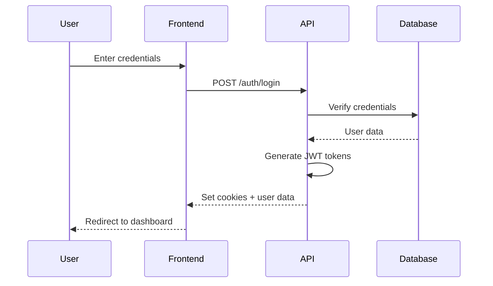
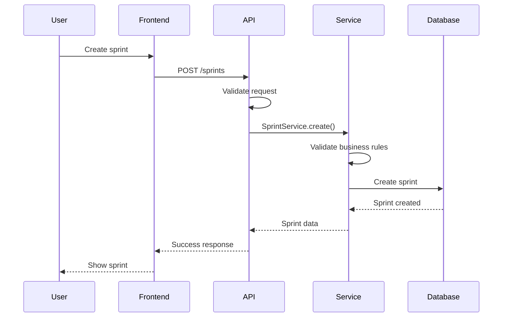
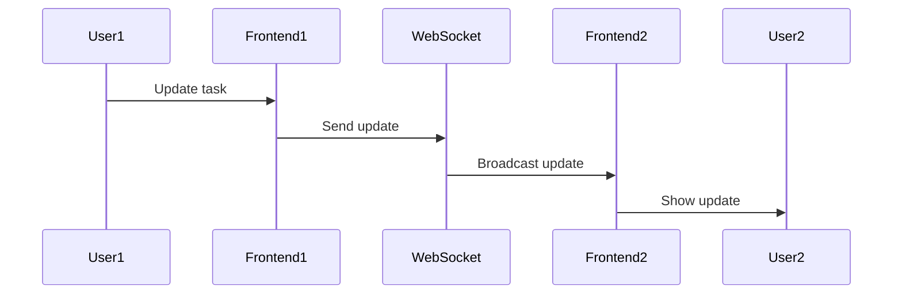

# System Architecture

This document provides a detailed overview of the Scrsphere system architecture, including architectural patterns, system components, communication protocols, and integration points.

## Table of Contents

- [Architectural Patterns](#architectural-patterns)
- [System Components](#system-components)
- [Communication Protocols](#communication-protocols)
- [Integration Points](#integration-points)
- [Data Flow](#data-flow)
- [Scalability Design](#scalability-design)

## Architectural Patterns

### 1. Layered Architecture

Scrsphere follows a layered architecture pattern with clear separation of concerns:

```
┌─────────────────────────────────────────┐
│         Presentation Layer              │
│  (React Components, UI Logic)           │
└─────────────────────────────────────────┘
                   │
                   ▼
┌─────────────────────────────────────────┐
│          API Gateway Layer              │
│  (Express Middleware, Routing)          │
└─────────────────────────────────────────┘
                   │
                   ▼
┌─────────────────────────────────────────┐
│        Business Logic Layer             │
│  (Services, Domain Logic)               │
└─────────────────────────────────────────┘
                   │
                   ▼
┌─────────────────────────────────────────┐
│         Data Access Layer               │
│  (Prisma ORM, Repositories)             │
└─────────────────────────────────────────┘
                   │
                   ▼
┌─────────────────────────────────────────┐
│           Database Layer                │
│  (PostgreSQL, Migrations)               │
└─────────────────────────────────────────┘
```

**Benefits**:

- Clear separation of concerns
- Easier testing and maintenance
- Independent layer evolution
- Better code organization

### 2. Service-Oriented Architecture (SOA)

The backend implements service-oriented design:

```
Controllers (HTTP Layer)
     │
     ├── Authentication Service
     ├── Team Service
     ├── Sprint Service
     ├── Backlog Service
     ├── Notification Service
     └── Workflow Service
          │
          └── Prisma ORM (Data Access)
```

**Benefits**:

- Reusable business logic
- Easier testing
- Better maintainability
- Clear responsibility boundaries

### 3. Repository Pattern

Data access is abstracted through Prisma ORM:

```typescript
// Service Layer
class TeamService {
  async createTeam(data: CreateTeamDto) {
    // Business logic
    return await prisma.team.create({
      data: teamData,
    });
  }
}

// Prisma provides repository-like interface
// with type-safe queries and transactions
```

**Benefits**:

- Type-safe database access
- Query abstraction
- Easier testing with mocks
- Transaction support

### 4. Component-Based Architecture (Frontend)

React components follow a hierarchical structure:

```
App
├── Layout
│   ├── Sidebar
│   ├── Header
│   └── Main Content
├── Pages
│   ├── Dashboard
│   ├── SprintBoard
│   ├── Backlog
│   └── Settings
└── Common Components
    ├── Button
    ├── Modal
    ├── Form
    └── Loading
```

**Benefits**:

- Reusable components
- Better state management
- Easier testing
- Improved maintainability

## System Components

### Frontend Components

#### 1. Core Application

- **App Component**: Root component with routing and providers
- **Layout Component**: Main layout with sidebar and header
- **Error Boundary**: Global error handling

#### 2. Feature Components

| Component      | Purpose              | State Management         |
| -------------- | -------------------- | ------------------------ |
| Dashboard      | Overview and metrics | TanStack Query           |
| SprintBoard    | Kanban board         | TanStack Query + Zustand |
| Backlog        | Product backlog      | TanStack Query           |
| TeamManagement | Team settings        | TanStack Query           |
| Reports        | Analytics            | TanStack Query           |

#### 3. Common Components

- **Button**: Reusable button with variants
- **Modal**: Dialog component
- **Form**: Form components with validation
- **Loading**: Loading states and skeletons
- **Error**: Error display components

#### 4. State Management

```
┌──────────────────────────────────────┐
│      Server State (TanStack Query)   │
│  - API data caching                  │
│  - Background refetching             │
│  - Optimistic updates                │
└──────────────────────────────────────┘

┌──────────────────────────────────────┐
│      Client State (Zustand)          │
│  - UI state                          │
│  - User preferences                  │
│  - Session data                      │
└──────────────────────────────────────┘
```

### Backend Components

#### 1. API Layer

**Routes**:

- Authentication routes (`/api/v1/auth/*`)
- Team routes (`/api/v1/teams/*`)
- Sprint routes (`/api/v1/sprints/*`)
- Backlog routes (`/api/v1/backlog/*`)
- Notification routes (`/api/v1/notifications/*`)

**Controllers**:

- Handle HTTP requests/responses
- Validate input
- Call appropriate services
- Format responses

#### 2. Middleware Stack

```
Request Flow:
1. Request ID Middleware
   └─> Assign unique ID for tracking

2. Context Middleware
   └─> Set up request context (AsyncLocalStorage)

3. Rate Limit Middleware
   └─> Check rate limits

4. Authentication Middleware
   └─> Verify JWT token

5. Authorization Middleware
   └─> Check permissions

6. Validation Middleware
   └─> Validate request body/params

7. Controller
   └─> Handle business logic

8. Error Middleware
   └─> Handle and format errors
```

#### 3. Service Layer

**Core Services**:

| Service             | Responsibility                        |
| ------------------- | ------------------------------------- |
| AuthService         | User authentication, token management |
| TeamService         | Team CRUD, member management          |
| SprintService       | Sprint planning, execution            |
| BacklogService      | Backlog management, prioritization    |
| NotificationService | Notification creation, delivery       |
| WorkflowService     | State transitions, permissions        |
| ReportService       | Metrics, analytics                    |

**Service Pattern**:

```typescript
class ExampleService {
  // Business logic methods
  async create(data: CreateDto): Promise<Entity> {
    // 1. Validate business rules
    // 2. Execute database operations
    // 3. Handle transactions
    // 4. Return result
  }

  // Transaction support
  async complexOperation() {
    return await prisma.$transaction(async (tx) => {
      // Multiple database operations
    });
  }
}
```

#### 4. Data Access Layer

**Prisma Client**:

- Type-safe database queries
- Connection pooling
- Transaction management
- Migration support

**Query Optimization**:

```typescript
// Select only needed fields
const user = await prisma.user.findUnique({
  where: { id },
  select: { id: true, email: true, firstName: true },
});

// Use include for relations
const team = await prisma.team.findUnique({
  where: { id },
  include: { members: true },
});
```

### Database Components

#### 1. Core Tables

- **users**: User accounts and profiles
- **teams**: Team definitions
- **team_members**: Team membership and roles
- **product_goals**: Strategic goals
- **product_backlog_items**: Backlog items
- **sprints**: Sprint definitions
- **tasks**: Sprint tasks
- **impediments**: Blockers and issues

#### 2. Relationship Tables

- **sprint_backlog_items**: Sprint-backlog association
- **increment_pbis**: Increment-backlog association
- **retro_item_votes**: Retrospective voting

#### 3. Configuration Tables

- **definition_of_done**: DoD checklists
- **definition_of_ready**: DoR checklists
- **workflow**: Workflow definitions
- **workflow_states**: Workflow states
- **workflow_transitions**: State transitions

## Communication Protocols

### 1. HTTP/HTTPS

**Request Format**:

```http
POST /api/v1/teams HTTP/1.1
Host: api.scrsphere.dev
Content-Type: application/json
Authorization: Bearer <token>
Cookie: accessToken=<token>

{
  "name": "Development Team",
  "description": "Main development team"
}
```

**Response Format**:

```http
HTTP/1.1 201 Created
Content-Type: application/json
X-Request-ID: req_abc123

{
  "success": true,
  "data": {
    "team": { ... }
  }
}
```

### 2. WebSocket (Future)

Real-time updates for:

- Sprint board changes
- Notification delivery
- Collaborative editing

### 3. Server-Sent Events (Future)

One-way communication for:

- Notification streams
- System announcements
- Activity feeds

## Integration Points

### 1. External Services

#### Avatar Service (DiceBear)

- **Purpose**: Generate user avatars
- **Integration**: HTTP API
- **Usage**: Profile images

#### Email Service (Future)

- **Purpose**: Send notifications
- **Integration**: SMTP or API
- **Usage**: Team invitations, alerts

### 2. Internal Integrations

#### Authentication Flow

```
Frontend → Backend API → Database
   │           │
   │           └─> JWT Token Generation
   │           └─> Session Management
   │
   └─> Cookie Storage
   └─> Token Refresh
```

#### Notification Flow

```
Backend Service → Notification Service → Database
                        │
                        └─> Create Notification
                        └─> Store in Database
                        └─> Frontend Polling
```

### 3. API Integration

**RESTful API**:

- Versioned endpoints (`/api/v1/`)
- Consistent request/response format
- Comprehensive error handling

**Future APIs**:

- GraphQL API
- Webhook support
- Public API for integrations

## Data Flow

### 1. User Authentication Flow



### 2. Sprint Creation Flow



### 3. Real-time Update Flow (Future)



## Scalability Design

### 1. Horizontal Scaling

**Backend**:

- Stateless design
- No server-side sessions
- External session storage (future)
- Load balancer ready

**Frontend**:

- Static file serving
- CDN compatible
- Client-side state management

### 2. Database Scaling

**Current**:

- Connection pooling
- Query optimization
- Proper indexing

**Future**:

- Read replicas
- Database sharding
- Caching layer (Redis)

### 3. Caching Strategy

**Frontend**:

- TanStack Query caching
- Service worker caching
- Browser caching

**Backend** (Future):

- Redis cache
- Query result caching
- Session caching

### 4. Performance Optimization

**Frontend**:

- Code splitting
- Lazy loading
- Bundle optimization
- Image optimization

**Backend**:

- Query optimization
- Connection pooling
- Response compression
- Rate limiting

## System Diagrams

### System Context Diagram

```
┌───────────────────────────────────────────────────────────┐
│                        External Users                     │
│  (Product Owners, Scrum Masters, Developers, Stakeholders)│
└───────────────────────────────────────────────────────────┘
                            │
                            │ HTTPS
                            ▼
┌───────────────────────────────────────────────────────────┐
│                      Scrsphere System                     │
│                                                           │
│  ┌─────────────────┐  ┌────────────────┐  ┌────────────┐  │
│  │   Frontend      │  │   Backend      │  │  Database  │  │
│  │   (React)       │◄─┤│   (Express)   │◄─┤│ (PostgreSQL)││
│  │                 │  │                │  │            │  │
│  │  - UI Components│  │  - REST API    │  │  - Tables  │  │
│  │  - State Mgmt   │  │  - Services    │  │  - Indexes │  │
│  │  - Routing      │  │  - Middleware  │  │  - Data    │  │
│  └─────────────────┘  └────────────────┘  └────────────┘  │
│                                                           │
│  ┌─────────────────────────────────────────────────────┐  │
│  │              Supporting Services                    │  │
│  │  - Authentication (JWT)                             │  │
│  │  - Logging (Winston)                                │  │
│  │  - Notifications                                    │  │
│  │  - Workflow Engine                                  │  │
│  └─────────────────────────────────────────────────────┘  │
└───────────────────────────────────────────────────────────┘
                            │
                            │ External APIs
                            ▼
┌───────────────────────────────────────────────────────────┐
│                    External Services                      │
│  - Avatar Service (DiceBear)                              │
│  - Email Service (Future)                                 │
│  - Analytics (Future)                                     │
└───────────────────────────────────────────────────────────┘
```

### Component Interaction Diagram

```
┌──────────────┐
│    Browser   │
└──────┬───────┘
       │
       │ HTTP/HTTPS
       ▼
┌──────────────────────────────────────────────┐
│              Frontend (React)                │
│  ┌───────────────────────────────────────┐   │
│  │         Component Layer               │   │
│  │  - Pages                              │   │
│  │  - Common Components                  │   │
│  │  - Feature Components                 │   │
│  └───────────────────────────────────────┘   │
│  ┌───────────────────────────────────────┐   │
│  │         State Management              │   │
│  │  - TanStack Query (Server State)      │   │
│  │  - Zustand (Client State)             │   │
│  └───────────────────────────────────────┘   │
│  ┌───────────────────────────────────────┐   │
│  │         API Client Layer              │   │
│  │  - Axios HTTP Client                  │   │
│  │  - Request Interceptors               │   │
│  │  - Error Handling                     │   │
│  └───────────────────────────────────────┘   │
└──────────────────────────────────────────────┘
       │
       │ REST API
       ▼
┌──────────────────────────────────────────────┐
│              Backend (Express)               │
│  ┌───────────────────────────────────────┐   │
│  │         Middleware Stack              │   │
│  │  - Authentication                     │   │
│  │  - Authorization                      │   │
│  │  - Validation                         │   │
│  │  - Rate Limiting                      │   │
│  └───────────────────────────────────────┘   │
│  ┌───────────────────────────────────────┐   │
│  │         Controller Layer              │   │
│  │  - Request Handling                   │   │
│  │  - Response Formatting                │   │
│  └───────────────────────────────────────┘   │
│  ┌───────────────────────────────────────┐   │
│  │         Service Layer                 │   │
│  │  - Business Logic                     │   │
│  │  - Domain Rules                       │   │
│  │  - Transaction Management             │   │
│  └───────────────────────────────────────┘   │
│  ┌───────────────────────────────────────┐   │
│  │         Data Access Layer             │   │
│  │  - Prisma ORM                         │   │
│  │  - Query Builder                      │   │
│  │  - Connection Pool                    │   │
│  └───────────────────────────────────────┘   │
└──────────────────────────────────────────────┘
       │
       │ SQL
       ▼
┌──────────────────────────────────────────────┐
│              Database (PostgreSQL)           │
│  - Tables                                    │
│  - Indexes                                   │
│  - Constraints                               │
│  - Triggers                                  │
└──────────────────────────────────────────────┘
```

---

**Last Updated**: 2026-05-10

**Related Documentation**:

- [Component Design](./component-design.md)
- [Data Model](./data-model.md)
- [API Specifications](./api-specifications.md)
